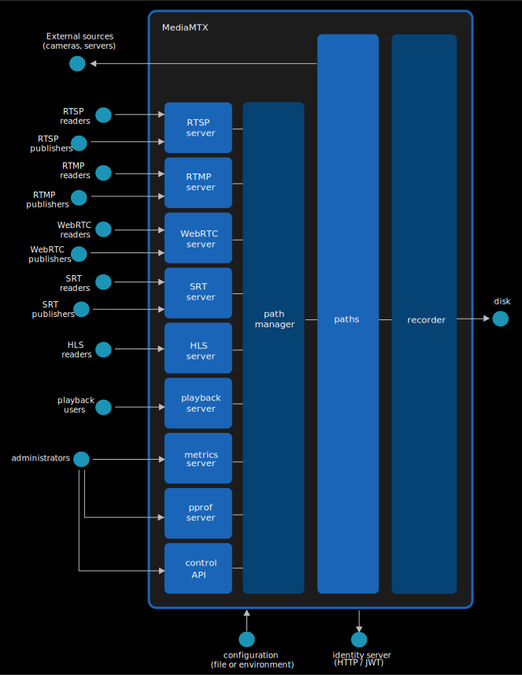

# Architecture

In order to provide its features, _MediaMTX_ performs the following network interactions:

- It interacts with any external source defined in the configuration, as a client, pulling streams.
- It exposes a series of servers that allow clients to publish and read streams with several protocols (RTSP, RTMP, WebRTC, SRT, HLS).
- It exposes a playback server that allows to read streams stored on disk.
- It exposes a series of administrative services (metrics, pprof, Control API).

Internally, the service revolves around these components:

- A path manager, that is in charge of managing paths, performing authentication and linking clients to paths.
- Paths. Each path contains a stream, which is provided by a single publisher or by a single external source, and is then broadcasted to any reader.
- A recorder, in charge of storing streams to disks.

Everything is controlled through configuration parameters, defined in the configuration file or in environment variables.

Furthermore, the server can be configured to interact with an identity server in order to perform authentication.
