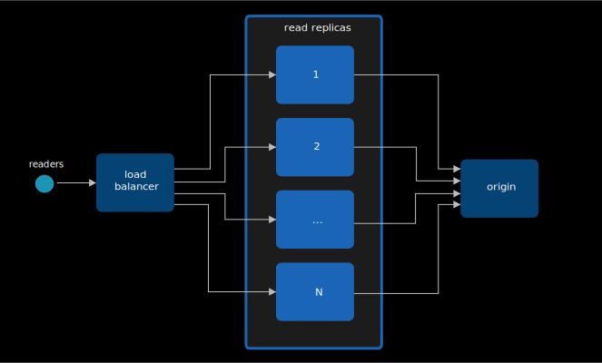

# Scalability

When handling large amounts of readers or publishers, streaming performance might get degraded due to bottlenecks in the underlying hardware infrastructure. In case of streaming without re-encoding (which is what MediaMTX does), these bottlenecks are almost always related to the limited bandwidth between server and readers. This issue can be strongly mitigated by implementing horizontal scalability, which means deploying multiple coordinated server instances, and evenly distributing load on them.

There are several methods available to implement horizontal scalability, the main ones are described in this page.

## Read replicas

The main technique for handling additional readers consists in instantiating additional MediaMTX instances, called read replicas, that are in charge of picking streams from a MediaMTX "origin" instance and serving them to users. User connections and requests are distributed to each replica by a load balancer.



Publishers are meant to publish to the origin instance.

Read replicas must be configured in this way:

- Add one or more proxy paths, pointing to the MediaMTX origin instance, as described in [Proxy](12-proxy.md).
- If the protocol used by readers is WebRTC, disable `webrtcLocalUDPAddress` and `webrtcLocalTCPAddress` and enable a STUN server, as described in [Solving WebRTC connectivity issues](26-webrtc-specific-features.md#solving-webrtc-connectivity-issues).

The load balancer has to behave differently depending on the protocol(s) readers are gonna use to read the stream:

- When using RTSP, RTMP, SRT, the load balancer must be a Layer 4 LB.
- When using HLS and WebRTC, the load balancer must be a Layer 7 LB with sticky sessions enabled. Sticky sessions are needed to forward HTTP requests from the same user to the same replica, since a single HLS or WebRTC session is composed of several HTTP requests.

### Generic implementation

1. On the machine meant to host the MediaMTX origin instance, launch the instance:

   ```sh
   docker run -d \
   --name mediamtx \
   --restart always \
   --network host \
   bluenviron/mediamtx:1
   ```

2. On machines meant to host read replicas, create this MediaMTX configuration (`mediamtx.yml`):

   ```yml
   webrtcLocalUDPAddress:
   webrtcICEServers2:
     - url: stun:stun.l.google.com:19302

   paths:
     "~^(.+)$":
       source: rtsp://dns-of-origin:8554/$G1
       sourceOnDemand: yes
   ```

   Replace `dns-of-origin` with the DNS or IP of the origin machine.

   Then launch MediaMTX:

   ```sh
   docker run -d \
   --name mediamtx \
   --restart always \
   --network host \
   -v $PWD/mediamtx.yml:/mediamtx.yml \
   bluenviron/mediamtx:1
   ```

3. On machines meant to host the load balancer, create this [Traefik](https://traefik.io/) configuration (`traefik.yml`):

   ```yml
   entryPoints:
     rtsp:
       address: ":8554"
     rtmp:
       address: ":1935"
     srt:
       address: ":8890/udp" # SRT usually uses UDP
     hls:
       address: ":8888"
     webrtc:
       address: ":8889"

   providers:
     file:
       filename: "/etc/traefik/dynamic_conf.yml"
       watch: true
   ```

   Create this second, dynamic, configuration (`dynamic_conf.yml`):

   ```yml
   tcp:
     routers:
       rtsp-router:
         rule: "HostSNI(`*`)"
         entryPoints: ["rtsp"]
         service: "rtsp-service"
       rtmp-router:
         rule: "HostSNI(`*`)"
         entryPoints: ["rtmp"]
         service: "rtmp-service"

     services:
       rtsp-service:
         loadBalancer:
         servers:
           - address: "replica-1-ip:8554"
           - address: "replica-2-ip:8554"
       rtmp-service:
         loadBalancer:
         servers:
           - address: "replica-1-ip:1935"
           - address: "replica-2-ip:1935"

   udp:
     routers:
       srt-router:
         entryPoints: ["srt"]
         service: "srt-service"
     services:
       srt-service:
         loadBalancer:
         servers:
           - address: "replica-1-ip:8890"
           - address: "replica-2-ip:8890"

   http:
     routers:
       hls-router:
         rule: "PathPrefix(`/`)"
         entryPoints: ["hls"]
         service: "hls-service"
       webrtc-router:
         rule: "PathPrefix(`/`)"
         entryPoints: ["webrtc"]
         service: "webrtc-service"

     services:
       hls-service:
         loadBalancer:
           sticky:
             cookie:
               name: "SERVERID"
         servers:
           - url: "http://replica-1-ip:8888"
           - url: "http://replica-2-ip:8888"
       webrtc-service:
         loadBalancer:
           sticky:
             cookie:
               name: "SERVERID"
         servers:
           - url: "http://replica-1-ip:8889"
           - url: "http://replica-2-ip:8889"
   ```

   Then launch Traefik:

   ```sh
   docker run -d \
   --name traefik \
   --restart always \
   --network host \
   -v $PWD/traefik.yml:/etc/traefik/traefik.yml \
   -v $PWD/dynamic_conf.yml:/etc/traefik/dynamic_conf.yml \
   traefik:v3.6.14
   ```

You can now use the IP address or DNS of the load balancer machines to read streams with any protocol.

It is also possible to entirely skip the load balancer setup by creating a domain name associated with all read replica IPs, and using that to read streams, although it is up to the DNS provider to randomize the IP order and it is up to clients to pick a random one.

### AWS implementation

1. Create a _Security group_ called `mediamtx-load-balancer`, that will be used by the load balancers. In _Inbound rules_, add:
   - a rule with type _All TCP_, source `0.0.0.0/0` (anywhere).
   - a rule with type _All UDP_, source `0.0.0.0/0` (anywhere).

2. Create a _Security group_ called `mediamtx-read-replicas`, that will be used by the read replicas. In _Inbound rules_, add:
   - a rule of type _SSH_. In the _source_ field, insert the IP range of administrators.
   - a rule with type _All TCP_, source _Custom_, pick the `mediamtx-load-balancer` security group.
   - a rule with type _All UDP_, source _Custom_, pick the `mediamtx-load-balancer` security group.

3. Create a _Security group_ called `mediamtx-origin`, that will be used by the origin. In _Inbound rules_, add:
   - a rule of type _SSH_. In the _source_ field, insert the IP range of administrators.
   - a rule with type _Custom TCP_, port `8554`, source _Custom_, pick the `mediamtx-read-replicas` security group.
   - a rule with type _All UDP_, source _Custom_, pick the `mediamtx-read-replicas` security group.
   - a rule of type _Custom TCP_, port `8554`. In the _source_ field, insert the IP range of publishers.
   - a rule of type _All UDP_. In the _Source_ field, insert the IP range of publishers.

4. Launch an EC2 instance that is meant to host the MediaMTX origin instance. Pick the _Amazon Linux_ AMI. Assign the `mediamtx-origin` _Security group_ to the instance. In _Advanced Details_, in the _User data_ textarea, copy and paste this:

   ```sh
   #!/bin/bash
   dnf update -y
   dnf install -y docker
   systemctl start docker
   systemctl enable docker
   usermod -aG docker ec2-user

   docker run -d \
   --name mediamtx \
   --restart always \
   --network host \
   bluenviron/mediamtx:1
   ```

5. Create a _Launch template_ for the read replicas. Pick the _Amazon Linux_ AMI. Assign the `mediamtx-read-replicas` _Security group_ to the launch template. In _Advanced Details_, in the _User data_ textarea, copy and paste this:

   ```sh
   #!/bin/bash
   dnf update -y
   dnf install -y docker
   systemctl start docker
   systemctl enable docker
   usermod -aG docker ec2-user

   mkdir -p /etc/mediamtx/
   tee /etc/mediamtx/mediamtx.yml << EOF
   webrtcLocalUDPAddress:
   webrtcICEServers2:
     - url: stun:stun.l.google.com:19302

   paths:
     "~^(.+)$":
       source: rtsp://dns-of-origin:8554/\$G1
       sourceOnDemand: yes
   EOF

   docker run -d \
   --name mediamtx \
   --restart always \
   --network host \
   -v /etc/mediamtx/mediamtx.yml:/mediamtx.yml \
   bluenviron/mediamtx:1
   ```

   Replace `dns-of-origin` with the private DNS of the origin EC2 instance.

6. Create several _Target groups_, with target type _Instances_, one for each of the following Protocol / Port combinations:
   - Name `mediamtx-read-replicas-8554`, Protocol _TCP_, port `8554` (RTSP), health check protocol _TCP_.
   - Name `mediamtx-read-replicas-1935`, Protocol _TCP_, port `1935` (RTMP), health check protocol _TCP_.
   - Name `mediamtx-read-replicas-8890`, Protocol _UDP_, port `8890` (SRT), health check protocol _TCP_, Advanced health check settings, Health check port, override, insert `8554`.
   - Name `mediamtx-read-replicas-8888`, Protocol _HTTP_, port `8888` (HLS), health check protocol _HTTP_, Advanced health check settings, Health check success codes `404`.
   - Name `mediamtx-read-replicas-8889`, Protocol _HTTP_, port `8889` (WebRTC), health check protocol _HTTP_, Advanced health check settings, Health check success codes `404`.

   Do not associate these target groups with any instance for now.

7. Select the `mediamtx-read-replicas-8888` target group, tab _Attributes_, _Edit_, section _Target selection configuration_, _Turn on stickiness_, _Save_. Do the same for the `mediamtx-read-replicas-8889` target group.

8. Create a _Load Balancer_, type _Network Load Balancer_. Assign the `mediamtx-load-balancer` _Security group_ to the load balancer. In _Listeners_, define 3 listeners:
   - Protocol _TCP_, port `8554` (RTSP), forward to target group `mediamtx-read-replicas-8554`
   - Protocol _TCP_, port `1935` (RTMP), forward to target group `mediamtx-read-replicas-1935`
   - Protocol _UDP_, port `8890` (SRT), forward to target group `mediamtx-read-replicas-8890`

9. Create a _Load Balancer_, type _Application Load Balancer_. Assign the `mediamtx-load-balancer` _Security group_ to the load balancer. In _Listeners_, define 2 listeners:
   - Protocol _HTTP_, port `8888` (HLS), forward to target group `mediamtx-read-replicas-8888`
   - Protocol _HTTP_, port `8889` (WebRTC), forward to target group `mediamtx-read-replicas-8889`

10. Create an _Auto scaling group_ for the read replicas. Pick the launch template that was defined before. CPU and Memory parameters are usually not important. In the _Load balancing_ section, pick _Attach to an existing load balancer_ and select all 5 target groups that were created before. In the _Group size_ section, in _Desired capacity_, set the desired instance count.

You can now use the DNS of the _Network Load Balancer_ to read streams with RTSP, RTMP and SRT, and the DNS of the _Application Load Balancer_ to read streams with HLS and WebRTC.

This process involved all available protocols, but it can be greatly simplified if users are meant to read streams with a single protocol only (for instance, WebRTC), in this case, opening specific ports only (8889) and creating specific load balancers only (Application load balancer) is enough.

## CDN

The read replicas technique provides the lowest latency, is compatible with all protocols and can be implemented on any on-premises or cloud environment, but it comes with some limitations regarding performance and cost:

- Sudden load spikes can be handled by adjusting read replica count, but this adjustement is not immediate and depends on either an autoscaling policy or a manual action, leading to a potential temporary performance degradation.
- Increasing the read replica count can lead to saturation of the bandwidth between read replicas and the origin, creating a new bottleneck.
- Each read replica requires a dedicated and potentially expensive machine.

An alternative way to serve streams consists in putting a CDN in front of the MediaMTX HLS server, in charge of storing cacheable files and serving requests, freeing the server from the load of most user requests. This method overcomes scalability and cost limitations, but has some drawbacks:

- Only the HLS protocol is available.
- Low-Latency HLS playlists cannot be cached and are always requested from the server, therefore it is often necessary to disable the Low-Latency HLS variant, introducing significant latency.
- Standard MediaMTX authentication mechanisms are not available. Streams are always accessible by anyone, unless the CDN enforces its own authentication system.

In order to allow MediaMTX to recognize CDN requests and serve cacheable files, the CDN must insert into every request an `Authorization: Bearer` header with a secret, that must match the one defined in the `hlsCDNSecret` configuration parameter in MediaMTX.

### Generic implementation

1. On the machine meant to host MediaMTX, create this MediaMTX configuration (`mediamtx.yml`):

   ```yml
   hlsCDNSecret: XXXXXXXXXX
   hlsVariant: fmp4
   paths:
     all:
   ```

   Replace `hlsCDNSecret` with some secret key. Using the `fmp4` HLS variant is strongly encouraged to prevent playlist requests from always reaching the server.

   Then launch MediaMTX:

   ```sh
   docker run -d \
   --name mediamtx \
   --restart always \
   --network host \
   bluenviron/mediamtx:1
   ```

2. Configure the CDN to use the MediaMTX machine as origin, and to inject `hlsCDNSecret` in the `Authorization: Bearer` header.

### AWS implementation

1. Create a _Security group_ called `mediamtx-load-balancer`, that will be used by the load balancer in front of the origin. In _Inbound rules_, add:
   - a rule with type _All TCP_, source `0.0.0.0/0` (anywhere).

2. Create a _Security group_ called `mediamtx-origin`, that will be used by the EC2 instance that will host MediaMTX. In _Inbound rules_, add:
   - a rule of type _SSH_. In the _source_ field, insert the IP range of administrators.
   - a rule of type _Custom TCP_, port `8554`. In the _source_ field, insert the IP range of publishers.
   - a rule of type _All UDP_. In the _Source_ field, insert the IP range of publishers.
   - a rule with type _All TCP_, source _Custom_, pick the `mediamtx-load-balancer` security group.

3. Create an _EC2 instance_. Assign the `mediamtx-origin` _Security group_ to the instance.

4. Log into the EC2 instance. create this MediaMTX configuration (`mediamtx.yml`):

   ```yml
   hlsCDNSecret: XXXXXXXXXX
   hlsVariant: fmp4
   paths:
     all:
   ```

   Replace `hlsCDNSecret` with some secret key. Using the `fmp4` HLS variant is strongly encouraged to prevent playlist requests from always reaching the server.

   Then launch MediaMTX:

   ```sh
   sudo dnf update -y
   sudo dnf install -y docker
   sudo systemctl start docker
   sudo systemctl enable docker
   sudo usermod -aG docker ec2-user
   sudo docker run \
   -d \
   --restart=always \
   --name mediamtx \
   --network host \
   -v $PWD/mediamtx.yml:/mediamtx.yml \
   bluenviron/mediamtx:1
   ```

5. Create a _Target group_. In _Target Type_ leave _Instance_, in _Protocol_ leave _HTTP_, in _Port_ insert `8888`. Open _Advanced health check settings_, in _Success codes_ insert `404`. Associate the _Target group_ with the EC2 instance.

6. Create a _Load Balancer_, type _Application Load Balancer_. Assign the `mediamtx-load-balancer` _Security group_ to the load balancer. In _Listeners_, set the HTTP port to `8888` and in _Target group_ select the target group that was created previously.

7. Create a _CloudFront_ distribution. Point it to the load balancer. In _HTTP port_, insert `8888`.

   In the distribution page, edit the origin. Under _Add custom header_, click on _Add header_ and fill:
   - Header name: `Authorization`
   - Value: `Bearer XXXXX` (replace XXXX with the `hlsCDNSecret` value)

   In the distribution page, edit the default behavior. In _Cache policy_, pick `UseOriginCacheControlHeaders`.

You can now use the URL of the _CloudFront_ distribution to read HLS streams, for instance:

```
https://xxxxxx.cloudfront.net/stream/
```

Replace `xxxxxx.cloudfront.net` with the distribution domain, and `stream` with the stream path.
